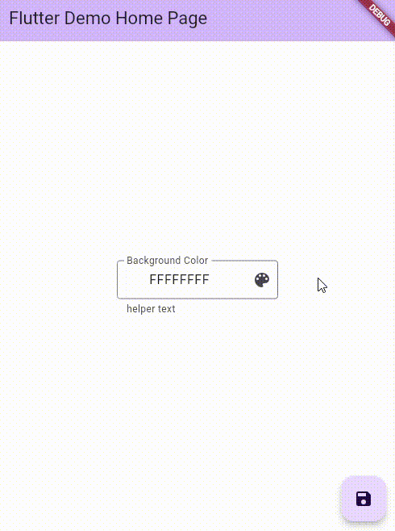

TextFormField with color picker and color preview.



## Features

Features include:

- Color picker (using flutter_colorpicker)
- Preview of selected color
- Padding with 'F' when the number of digits is less than 8
- Validation ([0-9a-fA-F])

## Getting started

```powershell
git clone https://github.com/esuno/colorpicker_textfield.git
```

Install required packages.

```powershell
flutter pub add flutter_colorpicker
```

## Usage

to `/example` folder.

```dart
final _backgroundKey = GlobalKey<FormFieldState<String>>();

ColorPickerTextField(
    textFieldGrobalKey: _backgroundKey,
    title: 'Background Color',
    helperText: 'helper text',
),
```

## Additional information

日本語の記事はQiitaにあります。
The Japanese article is on Qiita.
[]()
